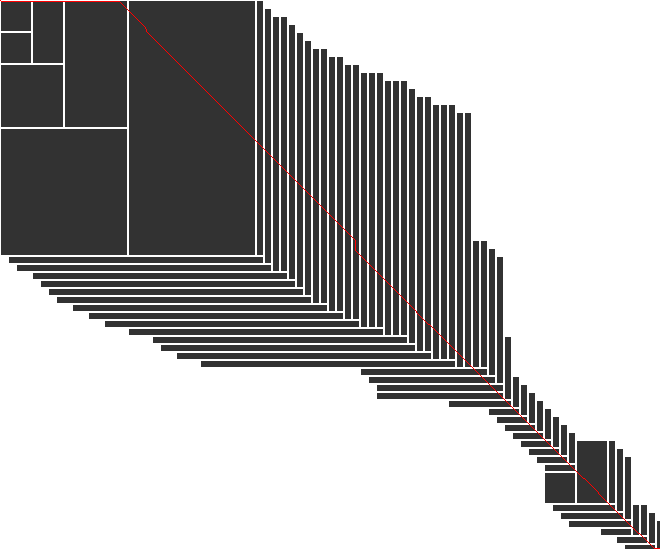

# block aligner
[](https://github.com/Daniel-Liu-c0deb0t/block-aligner/actions/workflows/ci.yaml)
[](LICENSE)
[](https://crates.io/crates/block_aligner)
[](https://docs.rs/block-aligner)

SIMD-accelerated library for computing global and X-drop affine gap penalty sequence-to-sequence or
sequence-to-profile alignments using an adaptive block-based algorithm.

Preprint paper available [here](https://www.biorxiv.org/content/10.1101/2021.11.08.467651).

<p align = "center">

</p>

## Example
```rust
use block_aligner::scan_block::*;
use block_aligner::scores::*;
use block_aligner::cigar::*;

let block_size = 16;
let gaps = Gaps { open: -2, extend: -1 };
let r = PaddedBytes::from_bytes::<NucMatrix>(b"TTAAAAAAATTTTTTTTTTTT", block_size);
let q = PaddedBytes::from_bytes::<NucMatrix>(b"TTTTTTTTAAAAAAATTTTTTTTT", block_size);

// Align with traceback, but no x drop threshold.
let mut a = Block::<true, false>::new(q.len(), r.len(), block_size);
a.align(&q, &r, &NW1, gaps, block_size..=block_size, 0);
let res = a.res();

assert_eq!(res, AlignResult { score: 7, query_idx: 24, reference_idx: 21 });

let mut cigar = Cigar::new(res.query_idx, res.reference_idx);
a.trace().cigar(res.query_idx, res.reference_idx, &mut cigar);

assert_eq!(cigar.to_string(), "2M6I16M3D");
```

## Algorithm
Pairwise alignment (weighted edit distance) involves computing the scores for each cell of a
2D dynamic programming matrix to find out how two strings can optimally align.
However, often it is possible to obtain accurate alignment scores without computing
the entire DP matrix, through banding or other means.

Block aligner provides a new efficient way to compute alignments on proteins, DNA sequences,
and byte strings.
Scores are calculated in a small square block that is shifted down or right in a greedy
manner, based on the scores at the edges of the block.
This dynamic approach results in a much smaller calculated block area, at the expense of
some accuracy.
To address problems with handling large gaps, we detect gaps by keeping track of the number
of iterations without seeing score increases. We call this "Y-drop", where Y is the threshold
number of iterations.
When the Y-drop condition is met, the block goes "back in time" to the previous best
checkpoint, and the size of the block dynamically increases to attempt to span the large gap.

Block aligner is built to exploit SIMD parallelism on modern CPUs.
Currently, AVX2 (256-bit vectors) and WASM SIMD (128-bit vectors) are supported.
For score calculations, 16-bit score values (lanes) and 32-bit per block offsets are used.

## Install
This library can be used on both stable and nightly Rust channels.
The nightly channel is needed for running tests and benchmarks. Additionally, the tests
and benchmarks need to run on Linux or MacOS.

To use this as a crate in your Rust project, add the following to your `Cargo.toml`:
```
[dependencies]
block-aligner = { version = "^0.2.0", features = ["simd_avx2"] }
```
Use the `simd_wasm` feature flag for WASM SIMD support. It is your responsibility to ensure
the correct feature to be enabled and supported by the platform that runs the code
because this library does not automatically detect the supported SIMD instruction set.

For developing, testing, or using the C API, you should clone this repo
and use Rust nightly. In general, when building, you need to specify the
correct feature flags through the command line.

For x86 AVX2:
```
cargo build --features simd_avx2 --release
```

For WASM SIMD:
```
cargo build --target=wasm32-wasi --features simd_wasm --release
```

Most of the instructions below are for benchmarking and testing block aligner.

## Data
Some Illumina/Nanopore (DNA) and Uniclust30 (protein) data are used in some tests and benchmarks.
You will need to download them by following the instructions in the [data readme](data/README.md).

## Test
1. `scripts/test_avx2.sh` or `scripts/test_wasm.sh`

CI will run these tests when commits are pushed to this repo.

For assessing the accuracy of block aligner on random data, run `scripts/accuracy_avx2.sh`,
`scripts/x_drop_accuracy_avx2.sh`, or `scripts/accuracy_wasm.sh`.
For Illumina/Nanopore or Uniclust30 data, run `scripts/nanopore_accuracy.sh` or
`scripts/uc_accuracy.sh`.

For debugging, there exists a `debug` feature flag that prints out a lot of
useful info about the internal state of the aligner while it runs.
There is another feature flag, `debug_size`, that prints the sizes of blocks after they grow.
To manually inspect alignments, run `scripts/debug_avx2.sh` with two sequences as arguments.

## Docs
1. `scripts/doc_avx2.sh` or `scripts/doc_wasm.sh`

This will build the docs locally.

## Compare
Edits were made to [Hajime Suzuki](https://github.com/ocxtal)'s adaptive banding benchmark code
and difference recurrence benchmark code. These edits are available [here](https://github.com/Daniel-Liu-c0deb0t/adaptivebandbench)
and [here](https://github.com/Daniel-Liu-c0deb0t/diff-bench-paper), respectively.
Go to those repos, then follow the instructions for installing and running the code.

If you run the scripts in those repos for comparing scores produced by different algorithms,
you should get `.tsv` generated files. Then, in this repo's directory, run
```
scripts/compare_avx2.sh /path/to/file.tsv 50
```
to get the comparisons. The X-drop threshold is specified after the path.

## Benchmark
1. `scripts/bench_avx2.sh` or `scripts/bench_wasm.sh`

For benchmarking Nanopore or Uniclust30 data, run `scripts/nanopore_bench.sh` or `scripts/uc_bench.sh`.

## Profiling with MacOS Instruments
Use
```
brew install cargo-instruments
RUSTFLAGS="-g" cargo instruments --example profile --release --features simd_avx2 --open
```

## Analyzing performance with LLVM-MCA
Use
```
scripts/build_ir_asm.sh
```
to generate assembly output and run LLVM-MCA.

## Viewing the assembly
Use either `scripts/build_ir_asm.sh`, `objdump -d` on a binary (avoids recompiling code in
some cases), or a more advanced tool like Ghidra (has a decompiler, too).

## WASM SIMD support
WASM SIMD has been stabilizing in Rust recently, so WASM support should be fairly good.
To run WASM programs, you will need [`wasmtime`](https://github.com/bytecodealliance/wasmtime)
installed and on your `$PATH`.

## C API
There are C bindings for block aligner. More information on how to use them is located in
the [C readme](c/README.md).

## Data analysis and visualizations
Use the Jupyter notebook in the `vis/` directory to gather data and plot them. An easier way
to run the whole notebook is to run the `vis/run_vis.sh` script.

## Other SIMD instruction sets
* [ ] SSE4.1 (Depends on demand)
* [ ] AVX-512 (I don't have a machine to test)
* [ ] NEON (I don't have a machine to test)

## Old ideas and history
See the [ideas](ideas.md) file.
